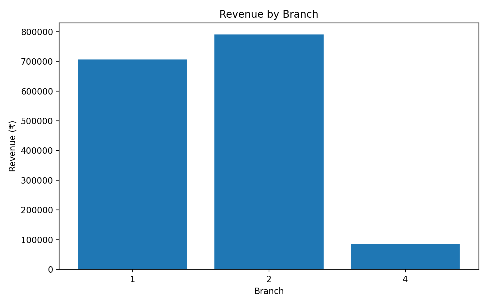
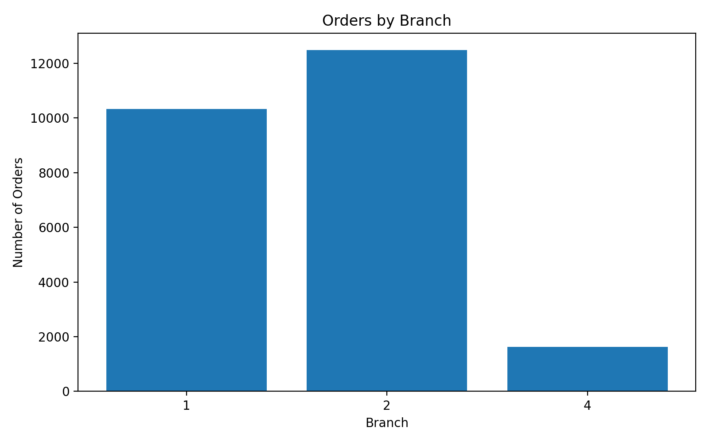
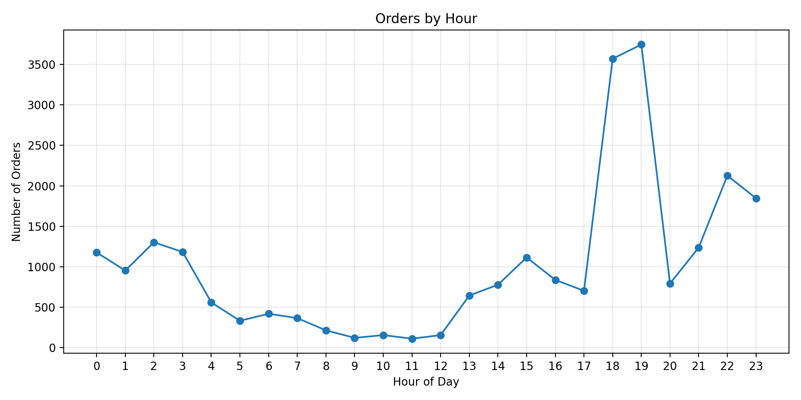
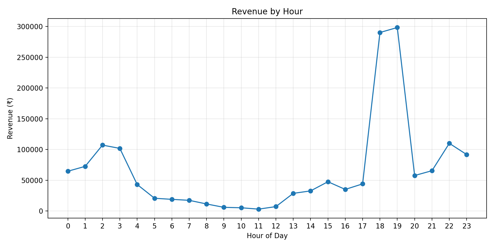
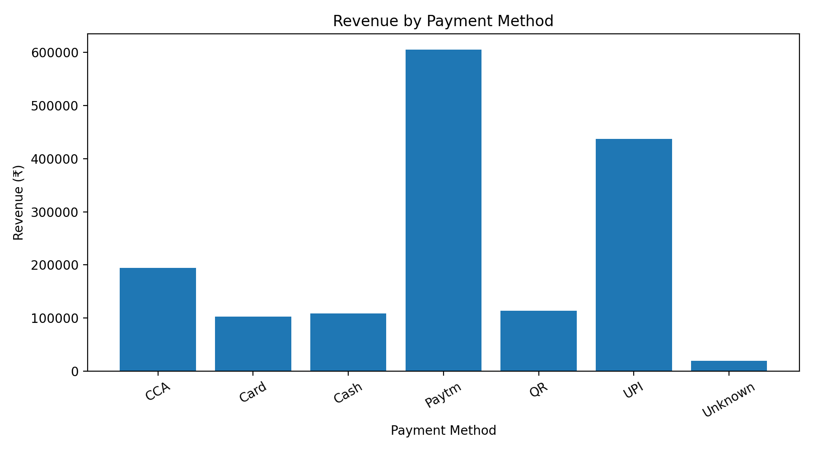
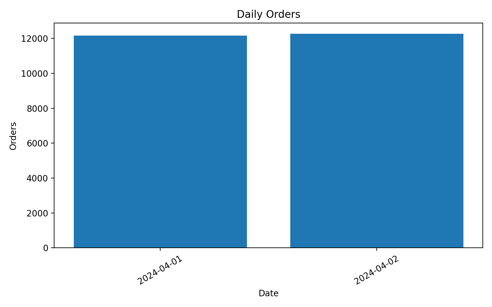
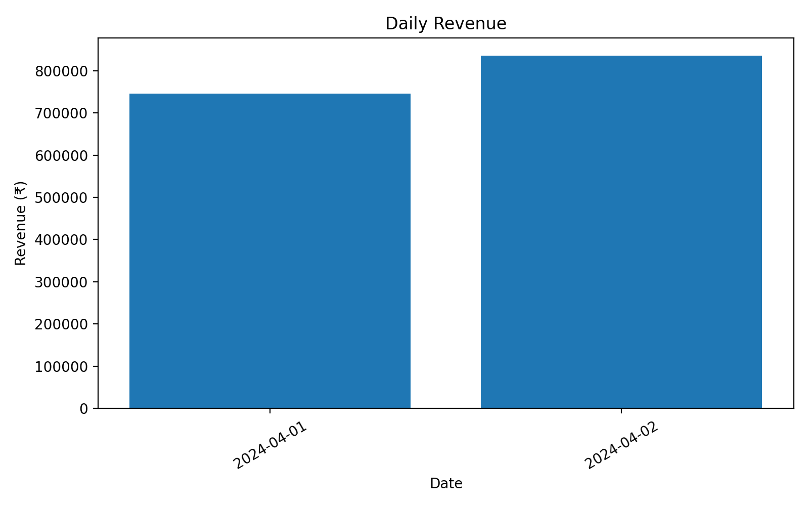
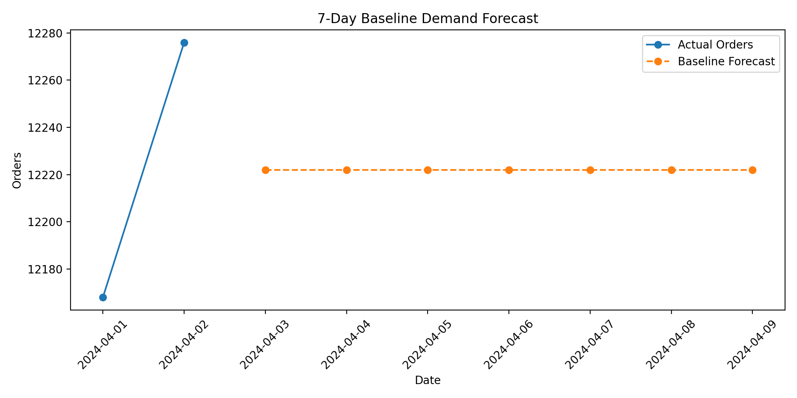

# ☕ Cafeteria Order Analytics & Demand Forecasting


## 📌 Project Overview

**Cafeteria Order Analytics & Demand Forecasting** is an end-to-end data analytics project developed as part of the **Kanishka Software Pvt. Ltd. Internship Evaluation Challenge**.

The project analyzes cafeteria transaction data using **MySQL and Python** to identify sales patterns, branch performance, payment behavior, peak ordering hours, data-quality issues, and baseline future demand.

### What I Worked On

- Analyzed **24,444 cafeteria transactions**
- Performed data cleaning and validation
- Calculated revenue, orders, and Average Order Value
- Compared performance across **3 branches**
- Identified peak ordering hours
- Analyzed payment methods
- Investigated zero-value transactions
- Identified repeated order-number values
- Generated analytical CSV reports
- Created data visualizations
- Built a simple baseline demand forecast
- Derived business insights from transaction data

---

## 👩‍💻 Author

**Akshada Valkunde**

Computer Engineering  
Padmabhushan Vasantdada Patil Pratishthan's College of Engineering & Visual Arts (PVPPCOE)

GitHub: [@vu1f2324001](https://github.com/vu1f2324001)

---

# 🎯 Objectives

- Analyze cafeteria order transaction data
- Measure overall revenue and order performance
- Calculate Average Order Value (AOV)
- Compare branch-wise sales and order volumes
- Identify peak ordering hours
- Analyze payment methods
- Detect data-quality issues
- Analyze zero-value transactions
- Identify repeated order-number values
- Create meaningful visualizations
- Generate a baseline demand forecast
- Derive business-oriented insights

---

# 📊 Dataset Summary

| Metric | Value |
|---|---:|
| Total Orders | **24,444** |
| Total Revenue | **₹15,81,186.20** |
| Average Order Value | **₹64.69** |
| Unique Customer IDs | **6,661** |
| Branches | **3** |
| Zero-Value Orders | **435** |
| Negative-Value Orders | **0** |
| Analysis Period | **1 Apr 2024 – 2 Apr 2024** |

> **Note:** The current analysis covers only two calendar days. Therefore, forecasting and trend analysis should be considered baseline analysis rather than long-term prediction.

---

# 🧹 Data Cleaning & Quality Checks

The transaction data was validated before performing the final analysis.

## Checks Performed

- Date and time conversion
- Payment method normalization
- Missing/unknown payment method handling
- Zero-value transaction detection
- Negative-value transaction detection
- Repeated order-number identification
- Branch uniqueness checks
- Customer ID uniqueness checks
- Transaction-level validation

---

# 💰 Zero-Value Transactions

A total of **435 orders** had `grand_total = ₹0`.

These records were not automatically deleted.

Further investigation showed:

- Positive subtotal values
- Positive reward amounts
- No refund indicators
- No cancellation reasons
- No recorded discounts

Therefore, these records were retained and flagged as `zero_value_order = True`.

This approach helps avoid deleting potentially valid transactions without proper investigation.

---

## 🔁 Repeated Order Numbers

Repeated `order_number` values were identified during data-quality analysis.

Record-level inspection showed that repeated order-number values can occur across transactions with differences in:

- Date
- Customer
- Branch
- Order value
- Payment method

Therefore, repeated order-number values were **flagged rather than automatically deleted**.

---

# 🏢 Branch Performance

| Branch | Orders | Revenue | AOV |
|---|---:|---:|---:|
| Branch 2 | 12,483 | ₹7,90,096.20 | ₹63.29 |
| Branch 1 | 10,326 | ₹7,06,472.00 | ₹68.42 |
| Branch 4 | 1,635 | ₹84,618.00 | ₹51.75 |

### Revenue by Branch



### Orders by Branch



### Observation

Branches 1 and 2 account for approximately **94.65% of total recorded revenue**.

Branch 2 recorded the highest order volume and revenue, while Branch 1 recorded a higher average order value.

---

# ⏰ Hourly Order Analysis

Hourly analysis was performed to identify high-demand ordering periods.

| Hour | Orders |
|---|---:|
| 19:00 | 3,746 |
| 18:00 | 3,571 |
| 22:00 | 2,127 |
| 23:00 | 1,846 |
| 02:00 | 1,302 |

### Orders by Hour



### Revenue by Hour



### Observation

The highest order volume was recorded at **19:00**, with 3,746 orders, followed by 18:00 with 3,571 orders.

The evening period shows the strongest recorded ordering activity in the two-day dataset.

---

# 💳 Payment Method Analysis

Payment methods were normalized into standard categories before analysis.

| Payment Method | Orders | Revenue | AOV | Revenue Share |
|---|---:|---:|---:|---:|
| Paytm | 10,109 | ₹6,05,197.70 | ₹59.87 | 38.27% |
| UPI | 5,591 | ₹4,36,978.00 | ₹78.16 | 27.64% |
| CCA | 2,823 | ₹1,94,752.00 | ₹68.99 | 12.32% |
| QR | 2,353 | ₹1,14,031.00 | ₹48.46 | 7.21% |
| Cash | 2,062 | ₹1,08,379.00 | ₹52.56 | 6.85% |
| Card | 1,210 | ₹1,02,551.00 | ₹84.75 | 6.49% |
| Unknown | 296 | ₹19,297.50 | ₹65.19 | 1.22% |

### Payment Revenue



### Observation

Paytm generated the highest recorded revenue share at **38.27%**, followed by UPI at **27.64%**.

Card transactions had the highest average order value among the listed payment methods at **₹84.75**.

---

# 📅 Daily Performance

| Date | Orders | Revenue | AOV |
|---|---:|---:|---:|
| 2024-04-01 | 12,168 | ₹7,45,170.20 | ₹61.24 |
| 2024-04-02 | 12,276 | ₹8,36,016.00 | ₹68.10 |

### Daily Orders



### Daily Revenue



### Observation

Between the two recorded days:

- Orders increased by approximately **0.89%**
- Revenue increased by approximately **12.19%**
- Average Order Value increased by approximately **11.20%**

Because the dataset covers only two days, these changes should not be interpreted as a long-term trend.

---

# 🔮 Demand Forecasting

A simple baseline forecasting approach was used because the available analysis dataset contains only two days of transaction history.

The baseline daily demand was calculated using the average number of daily orders:

**Average Daily Orders = 12,222 orders/day**

This value was used as a simple reference baseline for future demand estimation.

### Demand Forecast



> **Important:** This is a baseline forecast, not a production-ready machine-learning prediction. A reliable seasonal forecast would require several weeks or months of historical data.

---

# 💡 Business Insights

Based on the analyzed data:

1. **Branch 2** recorded the highest order volume and revenue.
2. **Branches 1 and 2** generated approximately **94.65%** of total recorded revenue.
3. **19:00** was the highest-volume ordering hour.
4. Evening hours showed strong ordering activity.
5. **Paytm** generated the largest revenue share among payment methods.
6. **UPI** recorded a higher AOV than Paytm.
7. **435 orders (1.78%)** had a grand total of ₹0 and were retained after data-quality investigation.
8. Repeated order-number values were flagged rather than automatically deleted because record-level differences were observed.
9. The two-day dataset limits long-term seasonality and forecasting conclusions.

---

# 🛠️ Technology Stack

- **Python 3.x**
- **Pandas** – Data cleaning and analysis
- **NumPy** – Numerical operations
- **Matplotlib** – Data visualization
- **MySQL 8.0** – Data storage and SQL analysis
- **Git & GitHub** – Version control and project hosting

---

# 🔄 Project Workflow

```text
Raw Transaction Data
        ↓
MySQL Database
        ↓
Data Extraction
        ↓
Data Cleaning
        ↓
Data Quality Checks
        ↓
Exploratory Data Analysis
        ↓
KPI Calculation
        ↓
Visualization
        ↓
Demand Baseline
        ↓
Business Insights
```

---

# 📁 Project Structure

```text
Cafeteria-Order-Analytics/
│
├── README.md
├── requirements.txt
│
├── clean_data.py
├── final_analysis.py
├── deep_analysis.py
├── create_charts.py
│
├── analytics_summary.csv
├── branch_analysis.csv
├── daily_analysis.csv
├── data_quality_summary.csv
├── forecast_results.csv
├── hourly_analysis.csv
├── payment_analysis.csv
│
└── outputs/
    ├── revenue_by_branch.png
    ├── orders_by_branch.png
    ├── orders_by_hour.png
    ├── revenue_by_hour.png
    ├── daily_orders.png
    ├── daily_revenue.png
    ├── payment_revenue.png
    ├── order_value_distribution.png
    └── demand_forecast.png
```

---

# ▶️ How to Run

## 1. Clone the Repository

```bash
git clone https://github.com/vu1f2324001/Cafeteria-Order-Analytics.git
cd Cafeteria-Order-Analytics
```

## 2. Install Dependencies

```bash
pip install -r requirements.txt
```

## 3. Configure MySQL

Make sure MySQL 8.0 is installed and running.

Configure the database connection in the Python scripts:

```python
host = "localhost"
user = "root"
password = "YOUR_PASSWORD"
database = "cafeteria_db"
```

> Never commit real passwords or credentials to GitHub.

## 4. Run Data Cleaning

```bash
python clean_data.py
```

## 5. Run Final Analysis

```bash
python final_analysis.py
```

The scripts generate analytical CSV files and visualization outputs.

---

# 🔐 Data Privacy

Raw database dumps and customer-level transaction data are intentionally excluded from the public repository.

The following files are excluded using `.gitignore`:

```text
Cafeteria Order Data.sql
users.sql
cleaned_orders.csv
```

This prevents large raw database files and transaction-level data from being publicly uploaded.

---

# ⚠️ Limitations

- The analyzed dataset covers only **1 April 2024 to 2 April 2024**.
- Two days of data are insufficient for reliable weekly, monthly, or seasonal analysis.
- The demand forecast is a simple baseline.
- Long-term demand patterns cannot be established from the current time range.
- Forecast accuracy cannot be meaningfully evaluated using only two historical days.
- Repeated order numbers do not necessarily represent duplicate transactions.
- Product-level demand forecasting is not included.

---

# 🚀 Future Improvements

With a larger historical dataset, the project can be extended with:

### Forecasting

- ARIMA
- Prophet
- XGBoost
- Random Forest
- LSTM
- MAE / RMSE / MAPE model evaluation

### Advanced Analytics

- Weekly and monthly trend analysis
- Seasonal demand analysis
- Branch-level demand forecasting
- Product-level sales analysis
- Customer segmentation
- RFM analysis
- Customer retention analysis
- Anomaly detection

### Business Intelligence

- Power BI dashboard
- Tableau dashboard
- Interactive Plotly dashboard
- Automated KPI reporting
- Real-time demand monitoring

### Operations

- Inventory demand prediction
- Staff scheduling based on peak hours
- Branch-specific demand planning
- Stock optimization

---

# 🎓 Skills Demonstrated

- SQL
- MySQL
- Python
- Pandas
- NumPy
- Matplotlib
- Data Cleaning
- Exploratory Data Analysis
- Data Visualization
- KPI Analysis
- Business Analytics
- Data Quality Analysis
- Baseline Demand Forecasting
- Git
- GitHub

---

# 🎓 Internship Evaluation Context

This project was developed for the:

**Kanishka Software Pvt. Ltd. Internship Evaluation Challenge**

The implementation demonstrates practical application of:

**SQL + Python + Data Cleaning + EDA + Visualization + Business Analysis + Forecasting**

---

# 📈 Project Outcome

This project demonstrates an end-to-end data analytics workflow:

**SQL → Data Cleaning → EDA → KPI Analysis → Visualization → Baseline Forecasting → Business Insights**

The project converts raw cafeteria transaction data into structured analytical outputs while documenting data-quality issues and clearly communicating the limitations of the available dataset.

---

# 👩‍💻 Author

**Akshada Valkunde**

Computer Engineering  
PVPPCOE

GitHub: [@vu1f2324001](https://github.com/vu1f2324001)

---

⭐ If you find this project useful, feel free to explore the repository and analysis outputs.
